# ZhaRaPorto 👨‍💼

---

---

## 🔗 LIVE DEMO & LAUNCH

> [!IMPORTANT]
> **🚀 LAUNCH PORTFOLIO HUD:** [👉 sulthanzharfan.github.io/my-portofolio/ 👈](https://sulthanzharfan.github.io/my-portofolio/)
---

## 🌌 Project Overview
**ZhaRaPorto** is a premium, futuristic cyberpunk/gaming HUD-themed developer portfolio designed to showcase skills, projects, work experience, and certifications. Built using **Next.js 15**, **React 19**, **TypeScript**, and **Tailwind CSS**, it features a fully bilingual interface (English & Indonesian) and responsive animations powered by **Framer Motion**.

The design is heavily inspired by sci-fi gaming interfaces, presenting information as "System Modules", "Quest Logs", and "Digital Artifacts" with glowing borders, hover micro-animations, and dynamic scanning lines.

---

## 🎯 Mengapa Saya Membuat Portofolio Ini?

Saya membangun website portofolio ini dengan tujuan utama untuk:

1. **Mempermudah Klien & Rekruter:** Menjadi pintu gerbang satu atap (*one-stop hub*) bagi klien, calon pemberi kerja, dan kolega profesional untuk melacak "Quest Log" (pengalaman karir), melihat "Digital Artifacts" (proyek), memverifikasi sertifikasi, dan langsung menghubungi saya secara instan.
2. **Karya Nyata Desain & Animasi:** Portofolio ini merepresentasikan keahlian saya dalam membangun aplikasi web dengan tools yang saya gunakan.
3. **Transparansi Kompetensi:** Menghadirkan semua pencapaian profesional dan modul keahlian saya secara terbuka.

---

## 🚀 Perjalanan Karir & Pengalaman (Quest Log)

* **PT. Prima Karya Sarana Sejahtera (Grup BRI)** - *Web Developer Intern / Software Engineer* (Maret 2026 - Sekarang)
  * Membantu pengembangan dan optimalisasi aplikasi web internal perusahaan guna menciptakan sistem operasional yang efisien dan andal.
* **Universitas Pancasila** - *Asisten Praktikum Pemrograman Berbasis Web* (September 2025 - Desember 2025)
  * Membimbing mahasiswa dalam mempelajari pemrograman berbasis web dengan fokus pada framework Laravel dan arsitektur web modern.
* **Universitas Pancasila** - *Asisten Praktikum Jaringan Komputer* (Maret 2025 - Juli 2025)
  * Mengajar praktikum jaringan komputer, berfokus pada Cisco Networking dan manajemen infrastruktur jaringan.
* **VINIX7** - *Magang Junior Web Developer & UI/UX* (Januari 2024 - Maret 2024)
  * Terlibat dalam merancang dan mengembangkan antarmuka web modern yang estetik serta responsif.

---

## 🧬 Senjata & Modul Keahlian (Tech Arsenal)

Dalam membangun solusi digital, saya mengandalkan modul teknologi berikut:

* **Antarmuka & Seluler (Frontend):** React, Next.js, TypeScript, Tailwind CSS, React Native.
* **Layanan & Basis Data (Backend):** Node.js, PostgreSQL, REST API.
* **Alat Kerja (Tools):** Git, Figma.

---

## 🏆 Verifikasi Sistem & Sertifikasi

* **Sertifikat Kompetensi BNSP - Web Developer** (Lembaga Sertifikasi Profesi, 2024)
* **Sertifikat Asisten Laboratorium Pemrograman Web** (Universitas Pancasila, 2025)
* **Sertifikat Magang Junior Web Developer & UI/UX** (VINIX7, 2024)
* **Sertifikat Asisten Laboratorium Jaringan Komputer** (Universitas Pancasila, 2025)

---

## 📊 Aktivitas GitHub (System Stats)

  
  

---

## ✉️ Hubungi Saya (Neural Link)

Saya selalu terbuka untuk kolaborasi proyek baru, peluang karir, maupun diskusi seputar pengembangan teknologi. Hubungi saya langsung melalui portal kontak di website portofolio atau kontak di bawah ini:

* **Email:** [zharfan2231@gmail.com](mailto:zharfan2231@gmail.com)
* **LinkedIn:** [linkedin.com/in/muhammadsulthanzharfan](https://www.linkedin.com/in/muhammadsulthanzharfan/)
* **GitHub:** [github.com/SulthanZharfan](https://github.com/SulthanZharfan)

---

## 📜 Lisensi
Proyek portofolio ini bersifat open-source dan berada di bawah lisensi [MIT License](LICENSE).
